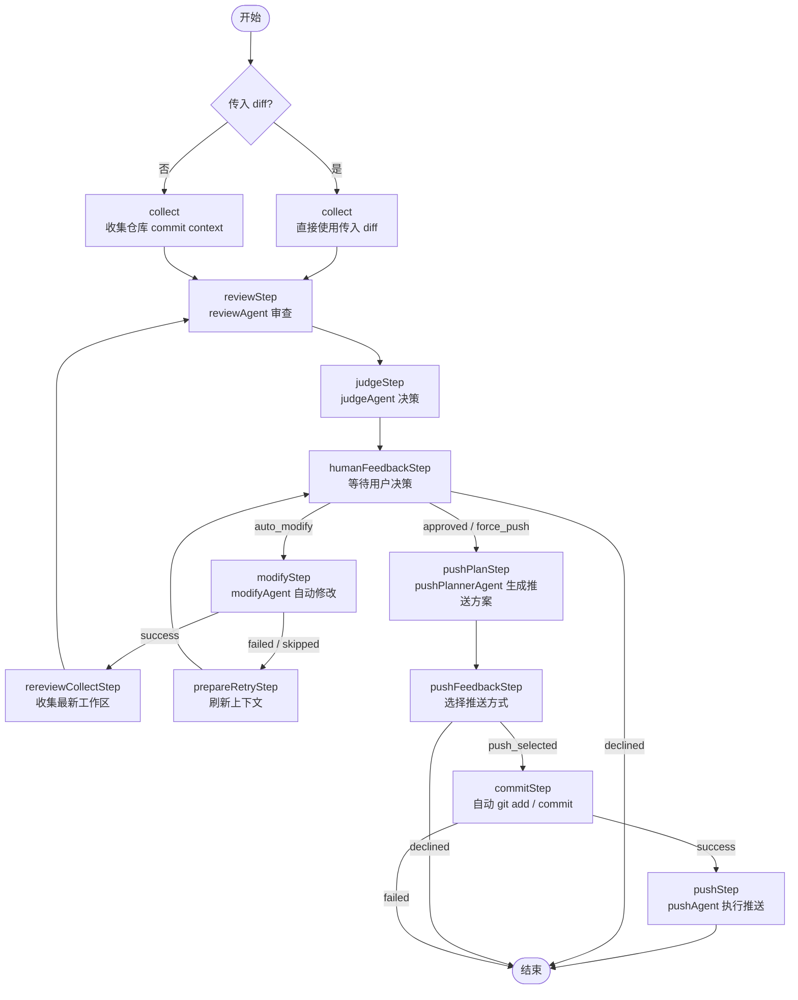

该项目是探索AI与开发过程的，接入 AI 来做的代码审查 cli，使用 langgraph 进行代码审查+自动修复并推送多环节的多 agent 任务编排和状态管理

目前算是一个 MVP 形式，可能不太健全无法覆盖一些边缘情况的项目，我只在我的一些前端项目中跑通流程

项目博客文章：[BLOG.md](./BLOG.md)

---

## 项目目录

这是一个 `pnpm workspace` monorepo，当前主要分成 `apps` 和 `packages` 两层：

```text
.
├── apps
│   └── cli
├── packages
│   └── core
├── package.json
└── pnpm-workspace.yaml
```

### apps/cli

- 命令行入口。
- 负责接收 `--repo`、`--diff`、`--limit` 等参数，并把结果打印到终端。
- 在需要人工决策时，负责承接交互式选择，例如自动修改、取消、选择推送方式。

### packages/core

- 核心业务包， `cli` 都是调用它。
- 对外主要暴露 `reviewCode`，内部使用 `langgraph` 编排完整工作流。

`packages/core/src` 下的主要模块：

- `agents/`
  各个 agent 的实现。
  包括 `collectAgent`、`reviewAgent`、`judgeAgent`、`modifyAgent`、`pushAgent`、`reviewInstructionAgent`。
- `workflow/`
  工作流编排层。
  `nodes.ts` 里定义 collect、review、judge、modify、push 等节点及流转关系。
- `schemas/`
  所有结构化输入输出定义，基于 `zod` 约束 review、modify、push 等数据结构。
- `utils/`
  通用工具方法。
  目前主要是 git 操作、frontmatter 解析和必填值校验。
- `shared/`
  跨 agent 复用的公共能力。
  当前主要是 `opencode` 返回结果的解析和错误格式化。

### packages/core/agents

- `collectAgent`: 获取指定仓库的提交的 agent，作用是从指定目录仓库获取最近 `--limit` 个提交，在review有问题选择自动修改后还会去拿最新的修改文件代码

- `reviewAgent`: 代码审查 agent，作用是读取 `collectAgent` 收集到的 commit context / diff，并结合内置的 review skills 输出结构化审查结果；会按 diff 内容选择 `common`、`frontend`、`backend`、`sql` 这些专项规则，产出 summary、severity、findings 和 decision。这些 skills 完全可以用自己团队的规则来替换，也可以自己定义新的 specialty rules。

- `judgeAgent`: 审查决策 agent，作用是根据 `reviewAgent` 产出的结构化审查结果判断流程下一步该怎么走；如果 review 通过，就进入推送确认，如果 review 不通过，就进入人工决策，询问是自动修改、强制继续还是取消。

- `reviewInstructionAgent`: 用户意见解释 agent，作用是在 review 不通过且用户给了补充意见后，把自然语言意见转换成结构化指令，分别提供给后续的 review、modify 阶段使用，避免后面几个 agent 只能理解“问题1先不修”这种模糊表达。

- `modifyAgent`: 自动修改 agent，作用是在用户选择自动修改后，根据 review findings、commit context 和用户补充意见调用 opencode 对目标仓库直接改代码，并返回本次修改是否成功、改了哪些文件、为什么跳过等结果。（不用opencode的团队可以使用其他的sdk替换）

- `pushPlannerAgent`: 推送方案规划 agent，作用是在 review 通过并且用户准备继续推送时，先分析当前仓库的分支、upstream、remote、最近提交和变更文件，再生成一组可选的 `git push` 方案，并尽量优先给出风险更低的推送方式。

- `pushAgent`: 推送执行 agent，作用是在用户明确选定某一个推送方案之后，严格按该方案执行实际的 `git push`，并返回推送命令、stdout/stderr 和最终是否成功。

## Workflow

核心流程对应 `packages/core/src/index.ts` 里的 `reviewWorkflow`，目前执行链路如下：



补充说明：

- 如果调用时直接传入 `diff`，会跳过仓库采集，直接进入 review。
- 如果 review 没过，用户可以选择自动修改，修改成功后会重新收集上下文并复审。
- 如果自动修改失败，会回到人工决策阶段，由用户决定是否继续。
- 只有 review 通过并且用户确认后，才会进入推送规划、提交和推送阶段。

## 本地开发

### 环境要求

- Node.js 22.x（建议，至少使用 Node.js 20+）
- pnpm 10.33.0
- Git
- 已开通并可访问 Google Vertex AI 的 GCP 项目

### 环境变量

先复制环境变量模板：

```bash
cp .env.example .env
```

`.env` 目前至少需要配置：

```bash
GOOGLE_CLOUD_PROJECT=your-gcp-project-id
# GOOGLE_APPLICATION_CREDENTIALS=/absolute/path/to/service-account.json
```

说明：

- `GOOGLE_CLOUD_PROJECT`：你的 GCP 项目 ID。
- `GOOGLE_APPLICATION_CREDENTIALS`：本地通过 service account key 鉴权时使用；如果你已经在本机配置了 Application Default Credentials，可以不填。

### 安装依赖

```bash
pnpm install
```

### 启动方式

#### 启动 CLI

先确认命令帮助：

```bash
pnpm dev:cli -- --help
```

对指定仓库执行一次代码审查：

```bash
pnpm dev:cli -- --repo /absolute/path/to/your-repo --limit 5
```

说明：

- `--repo`：要审查的目标仓库绝对路径。
- `--limit`：collect 阶段读取的最近 commit 数，默认是 `5`。
- 不传 `--repo` 时，默认审查当前工作目录。
- CLI 是一次性命令，不是常驻服务。

#### 持续化会话与中断恢复

现在工作流已经基于 LangGraph 的 checkpoint + `interrupt` 改成了可持续化会话模式。

当流程运行到人工决策节点时，状态会先持久化到本地 checkpoint 文件，然后等待恢复输入继续执行。

如果你在交互过程中手动中断（例如 `Ctrl+C`），CLI 会打印当前 `threadId`、checkpoint 路径，以及可直接使用的恢复命令。

启动一个带持久化的审查会话：

```bash
pnpm dev:cli -- --session --repo /absolute/path/to/your-repo --limit 5
```

查看某个会话当前停在哪：

```bash
pnpm dev:cli -- --status --thread <threadId>
```

恢复一个中断中的会话：

```bash
pnpm dev:cli -- --resume --thread <threadId>
```

可选参数：

- `--thread`：显式指定 thread id；不传时会自动生成。
- `--checkpoint`：指定 checkpoint 文件路径，默认是 `./.ai-code-review/checkpoints.sqlite`。

补充说明：

- 默认的一次性模式 `pnpm dev:cli -- --repo ...` 仍然可用，它会在当前进程内自动接管中断并继续执行。
- `--session` 模式更适合长流程、跨终端恢复、或者后续接 Web/API 场景。
- `--resume` 恢复时，需要使用和中断时相同的 `threadId` 与 checkpoint 文件路径。

如果你想用编译后的版本运行：

```bash
pnpm start:cli -- --repo /absolute/path/to/your-repo --limit 5
```
